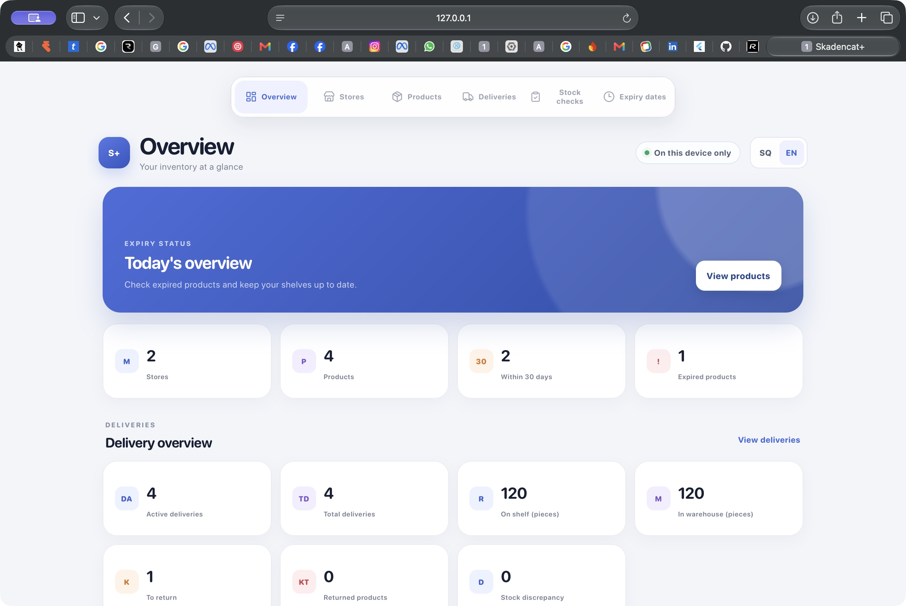
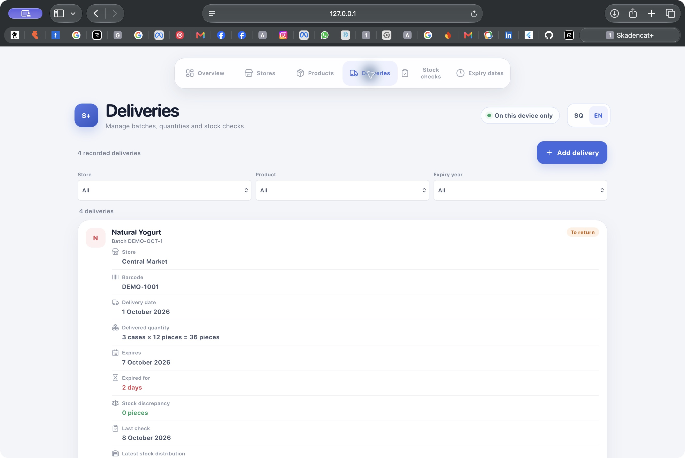

# Skadencat+

**Inventory, deliveries and expiry tracking for sales-agent workflows.**

Skadencat+ is a mobile-friendly web application for keeping track of products across retail stores: what was delivered, where the stock is, when it expires and what needs attention. The interface is available in English and Albanian, with inventory stored locally on the user's device.



*Screenshots use illustrative sample data captured in a separate preview. They do not represent customer records or usage metrics.*

## Features

- **Stores and products:** store details, product names, barcodes, quantities and expiry dates, with search and filters.
- **Delivery batches:** delivery dates, batch references and quantities entered as pieces or cases, with conversion to total pieces.
- **Stock checks:** dated counts for stock on shelves, in the warehouse, awaiting return, returned or damaged; discrepancies remain visible for verification.
- **Check history and returns:** notes, previous delivery checks, product returns and status changes.
- **Expiry overview:** separate groups for expired products, products expiring within 7 or 30 days and products outside those windows.
- **English / Albanian:** SQ / EN switching, localized interface messages and dates, browser-language detection and a saved language preference.
- **Mobile and offline support:** responsive layouts, a web app manifest and a service worker for caching the application shell.



## Technology

| Area | Implementation |
| --- | --- |
| Interface | JavaScript ES modules, HTML and CSS |
| Development and build | Vite |
| Device-local data | IndexedDB |
| Offline application shell | Service Worker and Cache API |
| Language preference | localStorage |
| Icons | Lucide |
| Automated tests | Node.js test runner |

## Engineering focus

The application separates interface rendering, data repositories and calculation utilities. IndexedDB transactions persist stores, products, deliveries, stock checks and status records. Quantity checks reject negative or fractional counts and prevent a recorded stock distribution or return from exceeding the available quantity in the relevant workflow.

Language switching changes interface text and date formatting while preserving record values, filters and quantities. Tests cover language selection, persistence, blocked preference storage, date formatting and the consistency of stock calculations across languages.

## Run locally

Use Node.js 22.12 or newer and npm.

```sh
git clone https://github.com/Arberleshi-Forge/skadencat-plus.git
cd skadencat-plus
npm ci
npm run dev
```

Open the local address printed by Vite. A new browser origin starts with an empty inventory. Add a store first, then products or deliveries. Use **SQ / EN** in the header to change language.

```sh
npm test
npm run build
npm run preview
```

The production build is generated in `dist/`. The GitHub Actions workflow runs installation, tests and the production build on pushes and pull requests.

## Data and deployment

Inventory stays in the browser's IndexedDB for the current origin and browser profile. The application has no account system or cloud synchronization; a different device or browser does not share the same records. Clearing site data removes the local inventory. A backup/export workflow is not currently provided.

Serve `dist/` over HTTPS for deployment. Service workers also work on localhost during development; offline use requires an initial visit to cache the application. Home-screen installation depends on browser and platform support. This repository does not currently provide a public hosted application URL.

## Project structure

```text
src/
  data/        IndexedDB transactions and record repositories
  i18n/        Language selection and English message catalog
  ui/          Pages, forms, filtering and user interaction
  utils/       Expiry-date and stock-quantity calculations
public/        Web app manifest and service worker
tests/         Language and calculation regression checks
docs/          Application screenshots
```

## Author

Personal project by **Arbër Leshi**, Software Engineering student in Tirana, Albania.

[GitHub profile](https://github.com/Arberleshi-Forge)
